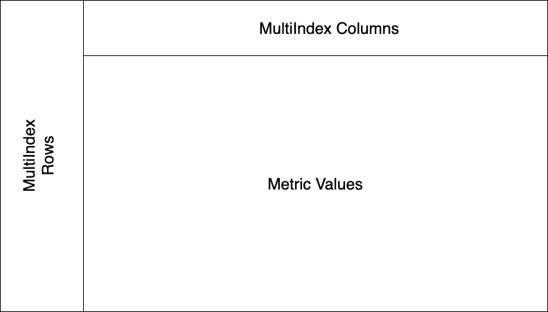
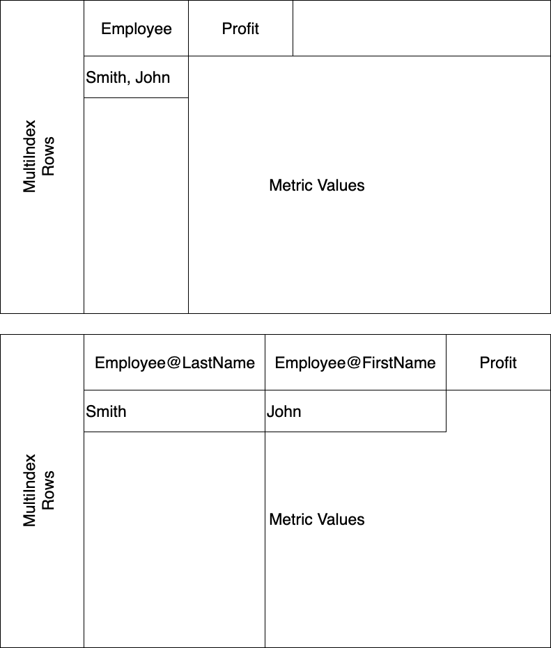

# Data API v2 Pandas Guide
This repo aims to demonstrate how to consume version 2 of the Data API for reports and cubes and create a Pandas DataFrame from the JSON object. The main parser is found in mstrdata/utils/dfcreator.py. The wrapper that utilizes the parser is found in mstrdata/microstrategy.py. 

## JSON Structure
The v2 JSON response for getting an instance of a cube and report consists of two main components to be used with pandas.
1) Definition
2) Data

### Definition
#### Structure
Individual Sales Analysis Report
```
"definition": {
        "grid": {
            "crossTab": false,
            "metricsPosition": {
                "axis": "columns",
                "index": 0
            },
            "rows": [
                {
                    "name": "Region",
                    "id": "8D679D4B11D3E4981000E787EC6DE8A4",
                    "type": "attribute",
                    "forms": [
                        {
                            "id": "CCFBE2A5EADB4F50941FB879CCF1721C",
                            "name": "DESC",
                            "dataType": "varChar",
                            "baseFormCategory": "DESC",
                            "baseFormType": "text"
                        }
                    ],
                    "elements": [
                        {
                            "formValues": [
                                "Northeast"
                            ],
                            "id": "h1;8D679D4B11D3E4981000E787EC6DE8A4"
                        },
                        {
                            "formValues": [
                                "Mid-Atlantic"
                            ],
                            "id": "h2;8D679D4B11D3E4981000E787EC6DE8A4"
                        },
                        {
                            "formValues": [
                                "Southeast"
                            ],
                            "id": "h3;8D679D4B11D3E4981000E787EC6DE8A4"
                        },
                        {
                            "formValues": [
                                "Central"
                            ],
                            "id": "h4;8D679D4B11D3E4981000E787EC6DE8A4"
                        },
                        {
                            "formValues": [
                                "South"
                            ],
                            "id": "h5;8D679D4B11D3E4981000E787EC6DE8A4"
                        },
                        {
                            "formValues": [
                                "Northwest"
                            ],
                            "id": "h6;8D679D4B11D3E4981000E787EC6DE8A4"
                        },
                        {
                            "formValues": [
                                "Southwest"
                            ],
                            "id": "h7;8D679D4B11D3E4981000E787EC6DE8A4"
                        },
                        {
                            "formValues": [
                                "Web"
                            ],
                            "id": "h12;8D679D4B11D3E4981000E787EC6DE8A4"
                        }
                    ]
                },
                {
                    "name": "Employee",
                    "id": "8D679D3F11D3E4981000E787EC6DE8A4",
                    "type": "attribute",
                    "forms": [
                        {
                            "id": "8D67A52E11D3E4981000E787EC6DE8A4",
                            "name": "Last Name",
                            "dataType": "nVarChar",
                            "baseFormCategory": "Employee DESC 1",
                            "baseFormType": "text"
                        },
                        {
                            "id": "8D67A53211D3E4981000E787EC6DE8A4",
                            "name": "First Name",
                            "dataType": "nVarChar",
                            "baseFormCategory": "Employee DESC 2",
                            "baseFormType": "text"
                        }
                    ],
                    "elements": [
                        {
                            "formValues": [
                                "Sawyer",
                                "Leanne"
                            ],
                            "id": "h30;8D679D3F11D3E4981000E787EC6DE8A4"
                        },
                        {
                            "formValues": [
                                "Kelly",
                                "Laura"
                            ],
                            "id": "h20;8D679D3F11D3E4981000E787EC6DE8A4"
                        },
                        {
                            "formValues": [
                                "Yager",
                                "Beth"
                            ],
                            "id": "h36;8D679D3F11D3E4981000E787EC6DE8A4"
                        },
                        {
                            "formValues": [
                                "Kieferson",
                                "Jack"
                            ],
                            "id": "h21;8D679D3F11D3E4981000E787EC6DE8A4"
                        },
                        {
                            "formValues": [
                                "De Le Torre",
                                "Sandra"
                            ],
                            "id": "h10;8D679D3F11D3E4981000E787EC6DE8A4"
                        },
                        {
                            "formValues": [
                                "Sonder",
                                "Melanie"
                            ],
                            "id": "h33;8D679D3F11D3E4981000E787EC6DE8A4"
                        },
                        {
                            "formValues": [
                                "Bernstein",
                                "Lawrence"
                            ],
                            "id": "h5;8D679D3F11D3E4981000E787EC6DE8A4"
                        },
                        {
                            "formValues": [
                                "Folks",
                                "Adrienne"
                            ],
                            "id": "h12;8D679D3F11D3E4981000E787EC6DE8A4"
                        },
                        {
                            "formValues": [
                                "Hollywood",
                                "Robert"
                            ],
                            "id": "h16;8D679D3F11D3E4981000E787EC6DE8A4"
                        },
                        {
                            "formValues": [
                                "Corcoran",
                                "Peter"
                            ],
                            "id": "h9;8D679D3F11D3E4981000E787EC6DE8A4"
                        },
                        {
                            "formValues": [
                                "Brown",
                                "Vernon"
                            ],
                            "id": "h7;8D679D3F11D3E4981000E787EC6DE8A4"
                        },
                        {
                            "formValues": [
                                "Ingles",
                                "Walter"
                            ],
                            "id": "h18;8D679D3F11D3E4981000E787EC6DE8A4"
                        },
                        {
                            "formValues": [
                                "Smith",
                                "Thomas"
                            ],
                            "id": "h32;8D679D3F11D3E4981000E787EC6DE8A4"
                        },
                        {
                            "formValues": [
                                "Young",
                                "Sarah"
                            ],
                            "id": "h37;8D679D3F11D3E4981000E787EC6DE8A4"
                        },
                        {
                            "formValues": [
                                "Lynch",
                                "Sam"
                            ],
                            "id": "h24;8D679D3F11D3E4981000E787EC6DE8A4"
                        },
                        {
                            "formValues": [
                                "Strome",
                                "Fred"
                            ],
                            "id": "h34;8D679D3F11D3E4981000E787EC6DE8A4"
                        },
                        {
                            "formValues": [
                                "McClain",
                                "Sean"
                            ],
                            "id": "h25;8D679D3F11D3E4981000E787EC6DE8A4"
                        },
                        {
                            "formValues": [
                                "Benner",
                                "Ian"
                            ],
                            "id": "h4;8D679D3F11D3E4981000E787EC6DE8A4"
                        },
                        {
                            "formValues": [
                                "Torrison",
                                "Mary"
                            ],
                            "id": "h35;8D679D3F11D3E4981000E787EC6DE8A4"
                        },
                        {
                            "formValues": [
                                "Gale",
                                "Loren"
                            ],
                            "id": "h13;8D679D3F11D3E4981000E787EC6DE8A4"
                        },
                        {
                            "formValues": [
                                "Zemlicka",
                                "George"
                            ],
                            "id": "h38;8D679D3F11D3E4981000E787EC6DE8A4"
                        },
                        {
                            "formValues": [
                                "Ellerkamp",
                                "Nancy"
                            ],
                            "id": "h11;8D679D3F11D3E4981000E787EC6DE8A4"
                        },
                        {
                            "formValues": [
                                "Pierce",
                                "Charles"
                            ],
                            "id": "h28;8D679D3F11D3E4981000E787EC6DE8A4"
                        },
                        {
                            "formValues": [
                                "Conner",
                                "Beatrice"
                            ],
                            "id": "h8;8D679D3F11D3E4981000E787EC6DE8A4"
                        },
                        {
                            "formValues": [
                                "Nelson",
                                "Arthur"
                            ],
                            "id": "h27;8D679D3F11D3E4981000E787EC6DE8A4"
                        },
                        {
                            "formValues": [
                                "Gedot",
                                "Harriet"
                            ],
                            "id": "h14;8D679D3F11D3E4981000E787EC6DE8A4"
                        },
                        {
                            "formValues": [
                                "Becker",
                                "Kyle"
                            ],
                            "id": "h2;8D679D3F11D3E4981000E787EC6DE8A4"
                        },
                        {
                            "formValues": [
                                "Hall",
                                "David"
                            ],
                            "id": "h15;8D679D3F11D3E4981000E787EC6DE8A4"
                        },
                        {
                            "formValues": [
                                "Bates",
                                "Michael"
                            ],
                            "id": "h1;8D679D3F11D3E4981000E787EC6DE8A4"
                        },
                        {
                            "formValues": [
                                "Bell",
                                "Caitlin"
                            ],
                            "id": "h3;8D679D3F11D3E4981000E787EC6DE8A4"
                        },
                        {
                            "formValues": [
                                "Hunt",
                                "Matthew"
                            ],
                            "id": "h17;8D679D3F11D3E4981000E787EC6DE8A4"
                        },
                        {
                            "formValues": [
                                "Johnson",
                                "Andrew"
                            ],
                            "id": "h19;8D679D3F11D3E4981000E787EC6DE8A4"
                        },
                        {
                            "formValues": [
                                "Schafer",
                                "Rose"
                            ],
                            "id": "h31;8D679D3F11D3E4981000E787EC6DE8A4"
                        },
                        {
                            "formValues": [
                                "Walker",
                                "Robert"
                            ],
                            "id": "h39;8D679D3F11D3E4981000E787EC6DE8A4"
                        }
                    ]
                }
            ],
            "columns": [
                {
                    "name": "Metrics",
                    "id": "00000000000000000000000000000000",
                    "type": "templateMetrics",
                    "elements": [
                        {
                            "name": "Sales",
                            "id": "4C05177011D3E877C000B3B2D86C964F",
                            "type": "metric",
                            "thresholds": [
                                0,
                                1
                            ],
                            "min": 24734.25,
                            "max": 852245.3499999924,
                            "dataType": "double",
                            "numberFormatting": {
                                "category": 1,
                                "decimalPlaces": 0,
                                "thousandSeparator": true,
                                "currencySymbol": "$",
                                "currencyPosition": 0,
                                "formatString": "\"$\"#,##0",
                                "negativeType": 1
                            }
                        },
                        {
                            "name": "Rank by Region",
                            "id": "7D629B284A802484ECED8D943A38980A",
                            "type": "metric",
                            "derived": true,
                            "min": 1.0,
                            "max": 8.0,
                            "dataType": "double",
                            "numberFormatting": {
                                "category": 0,
                                "formatString": "#,##0;(#,##0)"
                            }
                        }
                    ]
                }
            ],
            "pageBy": [],
            "sorting": {
                "rows": [
                    {
                        "type": "form",
                        "attribute": {
                            "id": "8D679D4B11D3E4981000E787EC6DE8A4",
                            "name": "Region"
                        },
                        "form": {
                            "id": "45C11FA478E745FEA08D781CEA190FE5",
                            "name": "ID"
                        },
                        "order": "ascending"
                    },
                    {
                        "type": "metric",
                        "metric": {
                            "id": "7D629B284A802484ECED8D943A38980A",
                            "name": "Rank by Region"
                        },
                        "order": "ascending"
                    }
                ],
                "columns": []
            },
            "thresholds": [
                {
                    "id": "4C05177011D3E877C000B3B2D86C964F#0",
                    "name": "New Threshold",
                    "type": "metric",
                    "format": {
                        "font-weight": true,
                        "font-color": "#f00"
                    },
                    "condition": "Revenue < 50000"
                },
                {
                    "id": "4C05177011D3E877C000B3B2D86C964F#1",
                    "name": "New Threshold (1)",
                    "type": "metric",
                    "format": {
                        "font-weight": true,
                        "font-color": "#008000"
                    },
                    "condition": "Revenue > 100000"
                }
            ]
        }
    },
```

The definition attribute contains the report's definition. For pandas integration we will use the "rows" and "columns" attributes within definition->grid. 

#### rows
Contains information about the rows that makes up the report. Each row has a name, a list of alternative forms, and elements (along with their alternative forms) that makes up that row. 

#### columns
Contains information about the columns that makes up the report. Each attribute column has a name, a list of alternative forms, and elements (along with their alternative forms) that makes up that column. The column attribute also has "Metrics" that do not have alternative forms, but still contain elements that makes up that column. Example from Electronics Revenue vs. Forecast report:

```
{
    "name": "Quarter",
    "id": "8D679D4A11D3E4981000E787EC6DE8A4",
    "type": "attribute",
    "forms": [
        {
            "id": "CCFBE2A5EADB4F50941FB879CCF1721C",
            "name": "DESC",
            "dataType": "varChar",
            "baseFormCategory": "DESC",
            "baseFormType": "text"
        }
    ],
    "elements": [
        {
            "formValues": [
                "2016 Q1"
            ],
            "id": "h20161;8D679D4A11D3E4981000E787EC6DE8A4"
        },
        {
            "formValues": [
                "2016 Q2"
            ],
            "id": "h20162;8D679D4A11D3E4981000E787EC6DE8A4"
        },
        {
            "formValues": [
                "2016 Q3"
            ],
            "id": "h20163;8D679D4A11D3E4981000E787EC6DE8A4"
        },
        {
            "formValues": [
                "2016 Q4"
            ],
            "id": "h20164;8D679D4A11D3E4981000E787EC6DE8A4"
        }
    ]
},
```
```
{
    "name": "Metrics",
    "id": "00000000000000000000000000000000",
    "type": "templateMetrics",
    "elements": [
        {
            "name": "Revenue Forecast",
            "id": "8D7D59C144AB891C57FEFA873ABE1C92",
            "type": "metric",
            "thresholds": [
                0
            ],
            "min": 8372.0,
            "max": 147310.4584000038,
            "dataType": "double",
            "numberFormatting": {
                "category": 1,
                "decimalPlaces": 0,
                "thousandSeparator": true,
                "currencySymbol": "$",
                "currencyPosition": 2,
                "formatString": "\"$\" #,##0;[RED](\"$\" #,##0)",
                "negativeType": 4
            }
        },
        ...
```

### Data
#### Structure
```
"data": {
        "currentPageBy": [],
        "paging": {
            "total": 34,
            "current": 34,
            "offset": 0,
            "limit": 1000
        },
        "headers": {
            "rows": [
                [
                    0,
                    0
                ],
                [
                    0,
                    1
                ],
                [
                    0,
                    2
                ],
                [
                    0,
                    3
                ],
                [
                    0,
                    4
                ],
                [
                    0,
                    5
                ],
                [
                    1,
                    6
                ],
                [
                    1,
                    7
                ],
                [
                    1,
                    8
                ],
                [
                    1,
                    9
                ],
                [
                    1,
                    10
                ],
                [
                    1,
                    11
                ],
                [
                    1,
                    12
                ],
                [
                    1,
                    13
                ],
                [
                    2,
                    14
                ],
                [
                    2,
                    15
                ],
                [
                    2,
                    16
                ],
                [
                    2,
                    17
                ],
                [
                    3,
                    18
                ],
                [
                    3,
                    19
                ],
                [
                    3,
                    20
                ],
                [
                    3,
                    21
                ],
                [
                    4,
                    22
                ],
                [
                    4,
                    23
                ],
                [
                    4,
                    24
                ],
                [
                    5,
                    25
                ],
                [
                    5,
                    26
                ],
                [
                    5,
                    27
                ],
                [
                    6,
                    28
                ],
                [
                    6,
                    29
                ],
                [
                    6,
                    30
                ],
                [
                    6,
                    31
                ],
                [
                    6,
                    32
                ],
                [
                    7,
                    33
                ]
            ],
            "columns": [
                [
                    0,
                    1
                ]
            ]
        },
        "metricValues": {
            "raw": [
                [
                    302400.3000000005,
                    1.0
                ],
                [
                    278238.4000000005,
                    2.0
                ],
                [
                    263247.1000000006,
                    3.0
                ],
                [
                    62033.4500000000,
                    4.0
                ],
                [
                    61800.5000000000,
                    5.0
                ],
                [
                    40269.3500000000,
                    6.0
                ],
                [
                    138064.0500000001,
                    1.0
                ],
                [
                    116088.3000000000,
                    2.0
                ],
                [
                    112044.2499999999,
                    3.0
                ],
                [
                    36742.5500000000,
                    4.0
                ],
                [
                    36544.9500000000,
                    5.0
                ],
                [
                    34064.1000000000,
                    6.0
                ],
                [
                    26936.3000000000,
                    7.0
                ],
                [
                    24734.25,
                    8.0
                ],
                [
                    68691.3000000000,
                    1.0
                ],
                [
                    68076.0999999999,
                    2.0
                ],
                [
                    66503.2500000000,
                    3.0
                ],
                [
                    59510.6500000000,
                    4.0
                ],
                [
                    209770.9500000003,
                    1.0
                ],
                [
                    204217.7500000002,
                    2.0
                ],
                [
                    104742.0,
                    3.0
                ],
                [
                    84781.0500000000,
                    4.0
                ],
                [
                    242298.0000000005,
                    1.0
                ],
                [
                    204740.7500000004,
                    2.0
                ],
                [
                    191403.2000000004,
                    3.0
                ],
                [
                    85634.3000000000,
                    1.0
                ],
                [
                    57970.6,
                    2.0
                ],
                [
                    48363.5000000000,
                    3.0
                ],
                [
                    125086.9500000000,
                    1.0
                ],
                [
                    122269.8500000000,
                    2.0
                ],
                [
                    78340.6000000000,
                    3.0
                ],
                [
                    53606.3000000000,
                    4.0
                ],
                [
                    51479.3500000000,
                    5.0
                ],
                [
                    852245.3499999924,
                    1.0
                ]
            ],
            "formatted": [
                [
                    "$302,400",
                    "1"
                ],
                [
                    "$278,238",
                    "2"
                ],
                [
                    "$263,247",
                    "3"
                ],
                [
                    "$62,033",
                    "4"
                ],
                [
                    "$61,801",
                    "5"
                ],
                [
                    "$40,269",
                    "6"
                ],
                [
                    "$138,064",
                    "1"
                ],
                [
                    "$116,088",
                    "2"
                ],
                [
                    "$112,044",
                    "3"
                ],
                [
                    "$36,743",
                    "4"
                ],
                [
                    "$36,545",
                    "5"
                ],
                [
                    "$34,064",
                    "6"
                ],
                [
                    "$26,936",
                    "7"
                ],
                [
                    "$24,734",
                    "8"
                ],
                [
                    "$68,691",
                    "1"
                ],
                [
                    "$68,076",
                    "2"
                ],
                [
                    "$66,503",
                    "3"
                ],
                [
                    "$59,511",
                    "4"
                ],
                [
                    "$209,771",
                    "1"
                ],
                [
                    "$204,218",
                    "2"
                ],
                [
                    "$104,742",
                    "3"
                ],
                [
                    "$84,781",
                    "4"
                ],
                [
                    "$242,298",
                    "1"
                ],
                [
                    "$204,741",
                    "2"
                ],
                [
                    "$191,403",
                    "3"
                ],
                [
                    "$85,634",
                    "1"
                ],
                [
                    "$57,971",
                    "2"
                ],
                [
                    "$48,364",
                    "3"
                ],
                [
                    "$125,087",
                    "1"
                ],
                [
                    "$122,270",
                    "2"
                ],
                [
                    "$78,341",
                    "3"
                ],
                [
                    "$53,606",
                    "4"
                ],
                [
                    "$51,479",
                    "5"
                ],
                [
                    "$852,245",
                    "1"
                ]
            ],
            ...
````
The data attribute contains information about what is actually being shown on each row and column of the report by mapping its index and values to the definition attribute listed above. 

The index of the column of the array in headers->rows maps to the same index in definition->grid->row, and the value at that column in header->rows maps to the index in definition->grid->row->elements

For example: 

```
"headers": {
            "rows": [
                [
                    0,
                    0
                ],
                [
                    0,
                    1
                ],
                [
                    0,
                    2
                ],
                ...
```
- [0,0]  
    - [0, _] 
        - column index = 0 -> row at index 0 of definition->grid->rows (Region row)
        - value = 0 -> element at index 0 of Region row (Northeast)
    - [_, 0] 
        - column index = 1 -> row at index 1 of definition->grid->rows (Employee row)
        - value = 0 -> element at index 0 of Employee row (Sawyer, Kelly)


- [0,1] 
    - [0, _] 
        - column index = 0 -> row at index 0 of definition->grid->rows (Region row)
        - value = 0 -> element at index 0 of Region row (Northeast)
    - [_, 1] 
        - column index = 1 -> row at index 1 of definition->grid->rows (Employee row)
        - value = 1 -> element at index 0 of Employee row (Kelly, Laura)
- ...

The same can be applied to the columns attribute in data->header->columns, except transposed; the row index correlates to the index of the column in definition->grid->column and the value correlates to the index of the element in that column in definition->grid->column->elements.

The metricValues attribute in data->metricValues contains the raw and formatted data from the report. There is no mapping here.


## Preparing Data for use with Pandas DataFrame
The Pandas DataFrame package allows us to easily produce a table matching the report once we have parsed the incoming JSON data from the v2 REST endpoint. The conversion from the report JSON response to a Pandas DataFrame looks something like this:

- data->header->rows --> Pandas' index (MultiIndex Row)
- data->header->columns --> Pandas' column names (MultiIndex Column)
- data->metricValues->raw --> Pandas' data (Metric Values)



We can create a DataFrame using only these 3 attributes by calling `pd.DataFrame(index=data->header->rows, columns=data->header->columns, data=data->metricValues->raw)` after mapping those data values to their definitions. 

### Parse
The parse function parses the incoming JSON object and formats it into Pandas ready objects that can easily be consumed. We parse each component separately. 
```
self._row_elements = self.parse_rows(json)
self._column_elements = self.parse_columns(json)
self._metric_elements = self.parse_metrics(json)
```
We parse the metric elements separately to account for its lack of alternate formValues; we just grab its element values without considering alternate formValues. However, the functionality of `parse_rows()` and `parse_columns()` requires us to recognize alternate formValues. The functionality is described in detail below. Additionally, we later join self._metric_elements  with self._column_elements since it also makes up the columns of the report:
`self._column_elements.append(self._metric_elements)`

After parsing the row and column elements, we use the data mapping in data->header->rows and data->header->columns to retrieve the actual values that will be placed in each row/column on the DataFrame. The functionality of `map_index()` is also described further below.
```
# data->headers->rows
row_index_map = json['data']['headers']['rows']
# data->headers->columns
column_index_map = json['data']['headers']['columns']

header_data_rows = self.map_index(self._row_elements, row_index_map) 
header_data_columns = self.map_index(self._column_elements, (np.array(column_index_map).T).tolist())
```
*Note that we Transpose the shape of the column elements*

Now we prepare our data to be used with: 

`pd.DataFrame(index=data->header->rows, columns=data->header->columns, data=data->metricValues->raw)`

```
# Our row (index=data->header->rows) index and column (columns=data->header->columns) index respectively
self._mi_rows = [np.array(header_data_rows).T.tolist()] # Transposed to match pandas MultiIndex dimmension
self._mi_cols = [np.array(header_data_columns).T.tolist()] # Transposed to match pandas MultiIndex dimmension

# Our row and column index titles/names respectively
self._row_names = list(map(lambda x: x['name'], self._row_elements))
self._col_names = list(map(lambda x: x['name'], self._column_elements))

# The data to populate the DataFrame (either raw or formatted)
self._raw_data = [(json['data']['metricValues']['raw'])]
self._formatted_data = [(json['data']['metricValues']['formatted'])]
```
#### Handling Large Datasets
v2 reports and cubes request defaults to a limit of 1000 response rows. If the dataset is too large, we paginate the results and append new rows to our parser data structure before creating the Pandas DataFrame. 
```
# append new row and metric data
self._mi_rows.append(mi_row)
self._raw_data += [(json['data']['metricValues']['raw'])]
self._formatted_data += [(json['data']['metricValues']['formatted'])]

```

#### parse_rows() & parse_columns()
`parse_rows()` and `parse_columns()` takes the definition->grid->rows and definition->grid->columns and extracts the relevant information into a list of dictionary objects. We also check for alternate attribute forms and separate them from the original JSON response as a separate row/column. For example; in the Individual Sales Analysis report, we have an Employee attribute with 2 alternate forms, a first name, and a last name. We separate those two forms and end up with something like this.

self._row_elements:
```
[
    {
        "name": "Region",
        "elements": ["Northeast", "Mid-Atlantic", "Southeast", ...],
        "index": 0
    },
    {
        "name": "Employee@LastName",
        "elements":  ["Sawyer", "Kelly"," Yager",...],
        "index": 1
    },
    {
        "name": "Employee@FirstName",
        "elements":  ["Leanne", "Laura"," Beth",...],
        "index": 1
    }
]
```
self._column_elements:
```
[
    {
        "name": "Metrics",
        "elements": ["Revenue Forecast", ...],
        "index": 0
    }
]
```
- *name* describes the row/column title. 
- *elements* describes the elements that are part of that row/column. 
- *index* describes its index position in definition->grid->row/column. 
    - We use *index* to determine the mapping from data->headers->rows/columns.

#### map_index()
`map_index(self, row_elements, index_map)` does most of the heavy lifting. It uses the dictionary objects from `parse_rows()` and `parse_columns()` along with the data mapping in data->header->rows/columns to create the values to be displayed on the DataFrame. It first expands the data mapping in data->headers->rows/columns to account for the extra row/column that will exist in our DataFrame because of potential alternate attribute forms (IE with Employee@LastName & Employee@FirstName). We insert that new column at the index specified in our dictionary object's *index* attribute. 
```
for row_element in row_elements:
    if row_element['index'] in visited_set: 
        # There was a previous map_index for this element
        col = list(map(lambda x: [x], index_map_copy[:,row_element['index']]))
        # appends along the column of our index map
        index_map_copy = np.insert(index_map_copy, [row_element['index']], col, 1)
    
    visited_set.append(row_element['index'])
```
So From:
```
[[
    0,
    0
],
[
    0,
    1
],
[
    0,
    2
],...]
```
To:
```
[[
    0,
    0,
    0
],
[
    0,
    1,
    1
],
[
    0,
    2,
    2
],...]
```
Then we map the indices in index_map_copy to their element values in row_elements: 
```
idx = 0
index_map_copy = index_map_copy.tolist()
for row_idx in index_map_copy:
    for i in range(len(row_idx)):
        row_value = (row_elements[i]['elements'][row_idx[i]])
        row_idx[i] = row_value

return index_map_copy
```

**Remember that row_elements is our dictionary object, with its elements attribute having the same index structure as definition->grid->rows/columns->elements. By inserting an additional column to the data->headers->rows/columns we break the intended mapping to definition->grid->rows/columns. Instead, we now use the index of `self._row_elements`(row_elements) and `self._column_elements`(column_elements) which have the additional rows to match the additional columns that we appended to the index map.** 



In the end we return this for our rows: 
```
[['Northeast', 'Sawyer', 'Leanne'], ['Northeast', 'Kelly', 'Laura'], ['Northeast', 'Yager', 'Beth'],...]
```

This for our columns:
```
[['Sales'], ['Rank by Region']]
```

## Converting to DataFrame

```
for raw, row in zip(self._raw_data, self._mi_rows):
    mi_rows = pd.MultiIndex.from_arrays(row, names=self._row_names)
    df = pd.DataFrame(index=mi_rows, columns=mi_cols, data=raw)
    res.append(df)     
```

To get the Pandas DataFrame to work with cross grid, we need to utilize Pandas MultiIndex indexing using pd.MultiIndex(). To account for large datasets, we create separate DataFrames for each batch of information that we get. Once everything is done, we can append the individual DataFrames together like so: `pd.concat(res)`. 


## Usage
```
json_response = response.json()
instance_id = json_response['instanceId']

# Gets the pagination totals from the response object
pagination = json_response['data']['paging']

# init data frame creator
dfc = DFCreator()
dfc.parse(json_response)

# If there are more rows to fetch, fetch them
if pagination['current'] != pagination['total']:

    # Fetch add'l rows from this object instance from the intelligence server
    for _offset in range(limit, pagination['total'], limit):
        response = reports.report_instance_id(connection=self,
                                                report_id=report_id,
                                                instance_id=instance_id,
                                                offset=_offset,
                                                limit=limit)
        dfc.parse(response.json())


return dfc._to_dataframe(raw=raw)
```
*json_response* is the result of calling POST api/v2/reports/instances or api/v2/cubes and *response* is the result of calling GET api/v2/reports/instances/:instance_id. Additionally, you can specify raw to be True or False to get either raw data (raw=True) or formatted data (raw=False).

## Demo
To run the demo, create a virtual environment:

`python3 -m venv test-env`


Activate the environment

`source test-env/bin/activate`


Install packages

`pip install -e .`

Run the notebook

`jupyter notebook`

Navigate to test/example.ipynb in jupyter and you'll find examples of how the parser is utilized. We have built the parser to work with [mstrio-py](https://github.com/MicroStrategy/mstrio-py) and its implementation for local python usage of MicroStrategy's report and cube objects. 


You can also view the demo notebook [here on github](/test)


